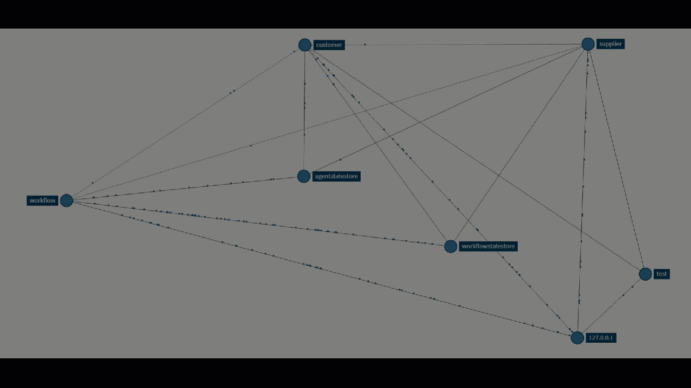

# Multi-Agent Workflow for RFP Challenges

This project showcases a multi-agent system where two agents collaborate to address RFP (Request for Proposal) challenges:

- **Client Agent:** Initiates the RFP process by presenting the proposal.
- **Supplier Agent:** Engages with the client to refine and validate the RFP, ensuring clarity and completeness.

The workflow is designed to emulate real-world scenarios where agents negotiate and validate proposals, fostering better communication and understanding between stakeholders.

Based on: https://www.diagrid.io/blog/building-effective-dapr-agents

## Prerequisites

- **Python 3.* (recommended: Python 3.10 or 3.11)
- **pip** (Python package manager)
- **python3.10-venv**
- **Dapr CLI** ([Install instructions](https://docs.dapr.io/get-dapr/cli/))
- **Docker** (for Dapr state store/pubsub components)
- **Redis** (for Dapr state store/pubsub, can be run via Docker)
- **Azure OpenAI resource** (for LLM-powered agents)
- **Linux or WSL2** (recommended for multi-app Dapr YAML support)

## Prepare the environment

> **Note:**  
> These steps are intended to be run on a **Linux** environment. The command `dapr run -f <yaml>` requires Linux to work properly with multiple applications defined in a YAML file.  
> **If you are on Windows, please install and run everything inside Ubuntu (WSL) or another Linux environment.**

```bash
cd src
python3 -m venv .venv
source .venv/bin/activate
dapr init
pip install -r requirements.txt
```

> **Tip:**  
> To exit the Python virtual environment (`.venv`), simply run:
> ```bash
> deactivate
> ```

## Create a .env file with the following content:

```bash
AZURE_OPENAI_API_KEY="<your-azure-openai-api-key>"
AZURE_OPENAI_ENDPOINT="https://<your-azure-openai>.openai.azure.com/"
AZURE_OPENAI_DEPLOYMENT="<openai-deployment-name>"
AZURE_OPENAI_API_VERSION="2025-01-01-preview"
DAPR_LLM_COMPONENT_DEFAULT="openai"
```

## Run the RPF Challenge Workflow

```bash
dapr run -f dapr-multi-agent-rpf-challenge-workflow.yaml
```
To monitor Dapr traces and metrics, you can open Zipkin in your browser. Default Zipkin URL: http://localhost:9411

## Workflow Overview



## Reviewing the Conversation with HumanResponse

After the workflow completes `LLMOrchestrator_state.json`, you can use the `HumanResponse` program to review the full conversation between the agents in a human-friendly Markdown format, and generate an AI-powered summary.

**What does HumanResponse do?**

- Reads the conversation state from the workflow.
- Generates a Markdown file (`conversation.md`) with the full dialogue between the ClientAgent and SupplierAgent.
- Optionally, creates a summarized version of the conversation using Azure OpenAI, saved as `conversation_resume.md`.

**How to use it:**

```bash
cd agent-demos/poc/humanresponse
python3 app.py conversation.md
```

This will generate a summary file named `conversation_resume.md` in the same directory, containing the main points and agreements from the conversation.

---

## Troubleshooting

If you encounter problems with Dapr (for example, errors with state stores, pubsub, or sidecars not starting), you can reset your Dapr installation with:

```bash
dapr uninstall --all
dapr init
```

This will remove all Dapr components and re-initialize Dapr.

---

## Credits

The files and the approach to responding to RFPs were inspired by examples from [Responsive.io](https://www.responsive.io/blog/rfp-examples).
